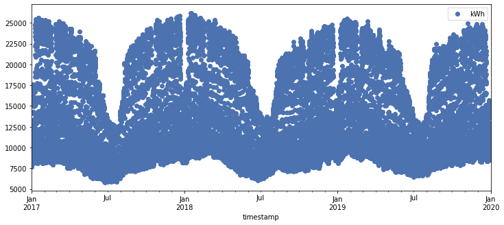
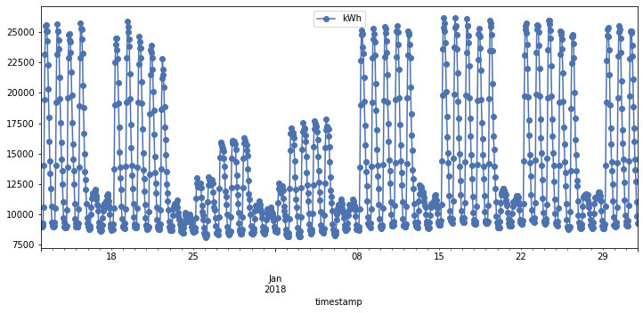
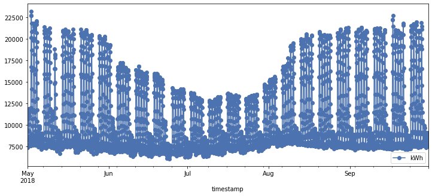
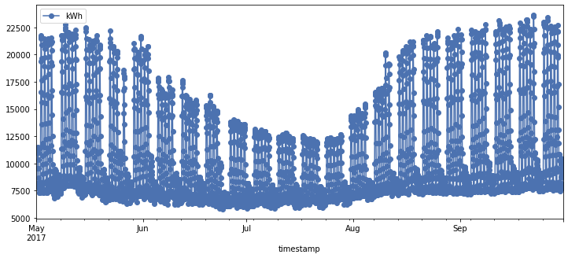
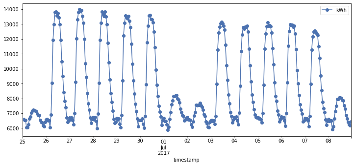
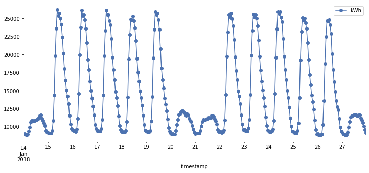
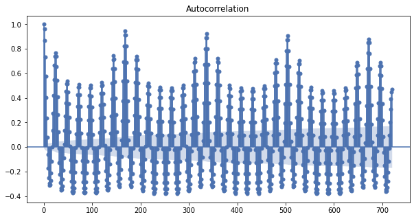
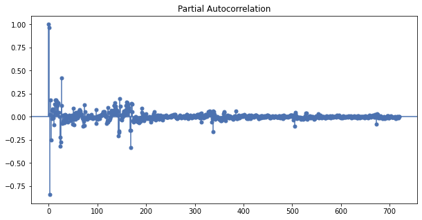

# Exploratory data analysis for hourly time series


```python
import pandas as pd
import numpy as np

from statsmodels.graphics.tsaplots import plot_acf, plot_pacf
from matplotlib import pyplot as plt, rc_context, rc
plt.style.use('seaborn-deep')
```

We start by reading the data


```python
df = pd.read_csv("hourly_total.csv", parse_dates=['timestamp'], index_col=['timestamp'])
df
```


<div>
<style scoped>
    .dataframe tbody tr th:only-of-type {
        vertical-align: middle;
    }

    .dataframe tbody tr th {
        vertical-align: top;
    }

    .dataframe thead th {
        text-align: right;
    }
</style>
<table border="1" class="dataframe">
  <thead>
    <tr style="text-align: right;">
      <th></th>
      <th>kWh</th>
    </tr>
    <tr>
      <th>timestamp</th>
      <th></th>
    </tr>
  </thead>
  <tbody>
    <tr>
      <th>2017-01-01 00:00:00</th>
      <td>7985.77</td>
    </tr>
    <tr>
      <th>2017-01-01 01:00:00</th>
      <td>7780.45</td>
    </tr>
    <tr>
      <th>2017-01-01 02:00:00</th>
      <td>7676.35</td>
    </tr>
    <tr>
      <th>2017-01-01 03:00:00</th>
      <td>7722.80</td>
    </tr>
    <tr>
      <th>2017-01-01 04:00:00</th>
      <td>7716.57</td>
    </tr>
    <tr>
      <th>...</th>
      <td>...</td>
    </tr>
    <tr>
      <th>2019-12-31 20:00:00</th>
      <td>11171.96</td>
    </tr>
    <tr>
      <th>2019-12-31 21:00:00</th>
      <td>10570.42</td>
    </tr>
    <tr>
      <th>2019-12-31 22:00:00</th>
      <td>10077.17</td>
    </tr>
    <tr>
      <th>2019-12-31 23:00:00</th>
      <td>9530.08</td>
    </tr>
    <tr>
      <th>2020-01-01 00:00:00</th>
      <td>9254.37</td>
    </tr>
  </tbody>
</table>
<p>26281 rows × 1 columns</p>
</div>


First, we look at some descriptive statistics about the data.


```python
df.describe()
```


<div>
<style scoped>
    .dataframe tbody tr th:only-of-type {
        vertical-align: middle;
    }

    .dataframe tbody tr th {
        vertical-align: top;
    }

    .dataframe thead th {
        text-align: right;
    }
</style>
<table border="1" class="dataframe">
  <thead>
    <tr style="text-align: right;">
      <th></th>
      <th>kWh</th>
    </tr>
  </thead>
  <tbody>
    <tr>
      <th>count</th>
      <td>26281.000000</td>
    </tr>
    <tr>
      <th>mean</th>
      <td>12064.554405</td>
    </tr>
    <tr>
      <th>std</th>
      <td>4915.637292</td>
    </tr>
    <tr>
      <th>min</th>
      <td>5801.520000</td>
    </tr>
    <tr>
      <th>25%</th>
      <td>8453.570000</td>
    </tr>
    <tr>
      <th>50%</th>
      <td>10111.080000</td>
    </tr>
    <tr>
      <th>75%</th>
      <td>14381.880000</td>
    </tr>
    <tr>
      <th>max</th>
      <td>26206.430000</td>
    </tr>
  </tbody>
</table>
</div>


Note that this data is on the hourly resolution; therefore, the max value is much lower than the average (or even the minimum) value of the daily data. Next, we try to visualize the time series to gain some insights.


```python
df.plot(figsize=(12,5), style='o')
plt.show()
```


    

    


The plot above is practically illegible as the time-series is in high resolution (hourly data). We could only identify some general patterns from the data above. For example, we notice that the demand peaks in winter-spring then bottoms out during summer. We should zoom in on different parts of the series.


```python
def plot(data, start, end):
    data.loc[start:end].plot(figsize=(12,5), style='o-')
    plt.show()  


plot(df, '2017-12-12', '2018-01-31')
```


    

    


It looks like that during the holidays (winter - new year), there is low electricity demand. In addition, during the weekend, the demand is lower than in the weekdays. Next, we investigate the summer months.


```python
plot(df, '2018-05-01', '2018-09-30')
```


    

    


Compared to the plot above, it is clear that the demand in the summer is lower than the other seasons. There is a decreasing trend in demand in the first half of the year, and there is an increasing trend in the second half of the year. This situation should be the same for 2017: 


```python
plot(df, '2017-05-01', '2017-09-30')
```


    

    


Indeed it is. Next, we zoom in on a random week.


```python
plot(df, '2017-06-25', '2017-07-08')
plot(df, '2018-01-14', '2018-01-27')
```


    

    


    

    


The plot above further emphasizes the weekly trend as well as reveals the daily trends: the demand tend to peak locally at around noon (Finnish time). The trends and seasonalities above (except for the daily seasonality) are also explained in the Exploratory Data Analysis for daily data section.

Since this is a time series, we should look at its autocorrelation function plot to identify any patterns that could potentially help us build common models such as ARIMA.


```python
with rc_context():
    rc("figure", figsize=(10,5))
    plot_acf(df['kWh'], lags=720) # 720 hours, or 30 days
    plt.show()
```


    

    


```python
with rc_context(): # takes quite some time to run
    rc("figure", figsize=(10,5))
    plot_pacf(df['kWh'], lags=720)
    plt.show()
```


    

    


As is identified above and further confirmed with these two plots, this time series has multiple seasonality and complex seasonality patterns. For this kind of time series, ARIMA (a common time series model) will not work very well.
